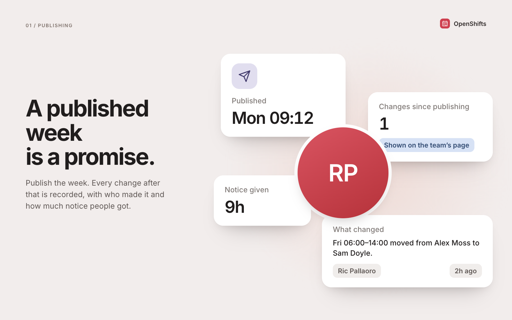
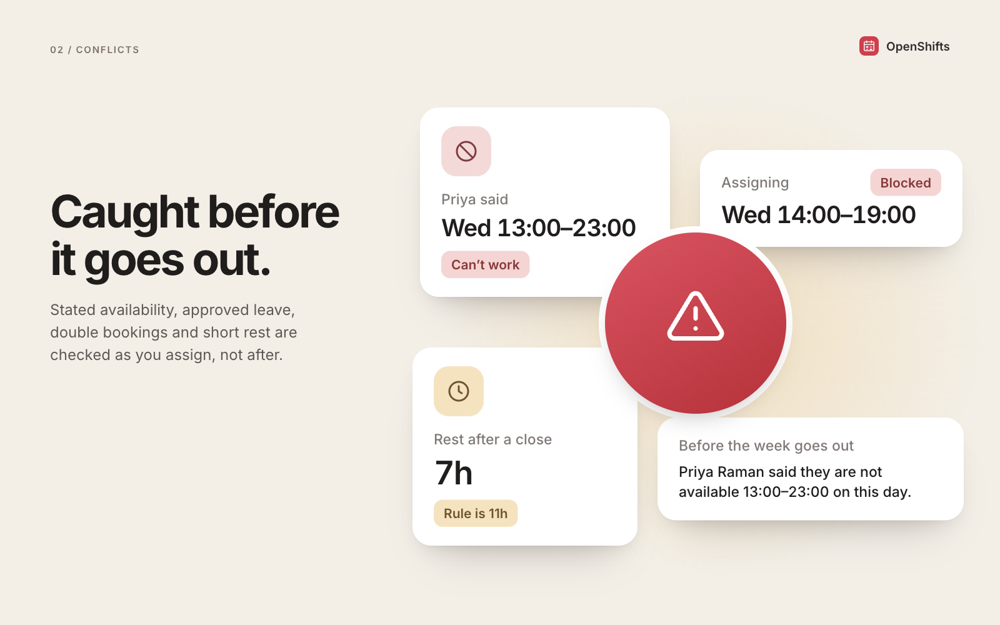
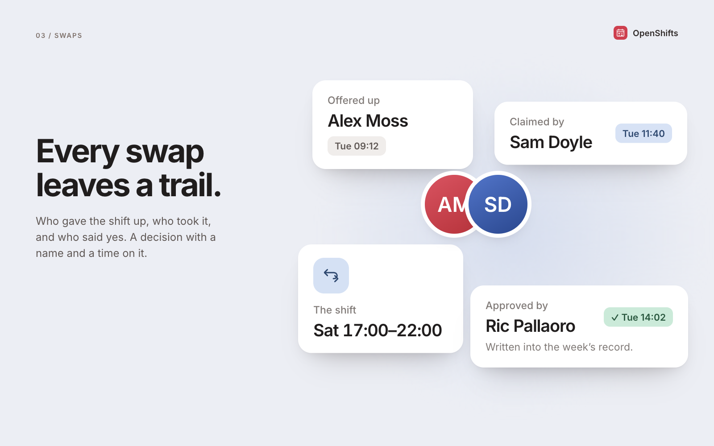
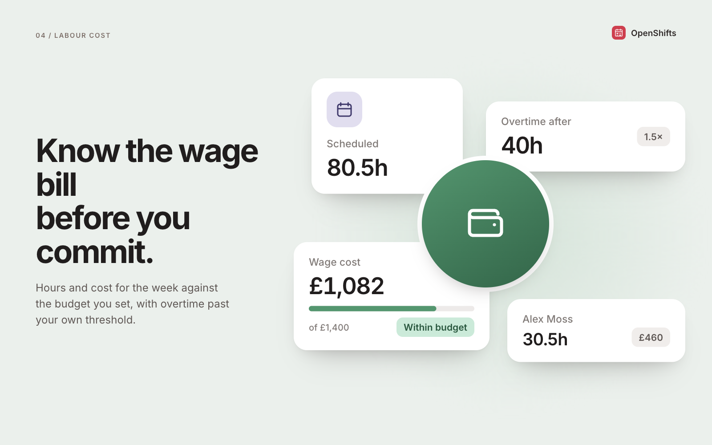

<picture>
  <source media="(prefers-color-scheme: dark)" srcset="readme-banner-dark.png" />
  
</picture>

# OpenShifts

Scheduling, time tracking and shift swaps for teams that work shifts: cafes and
restaurants, hotels, retail floors, care homes, warehouses, production lines.

An open-source app template provided by [Clawnify.com](https://clawnify.com).

**A published week is a promise.** Most rota tools let a schedule go out and then
quietly change underneath the people working it. This one records every edit made
after a week is published, with who made it and how much notice it carried, and
shows that record to the team on the same page as the rota.

[](https://app.clawnify.com/deploy?repo=clawnify/OpenShifts)

## What it does



**Publishing is the promise.** The week goes out, and from that moment every edit
writes a record carrying who made it and how many hours of notice the shift had.
The team reads that record on their own page, beside the rota.



**Conflicts surface as you assign, not after.** Stated availability, approved
leave, double bookings and short rest are checked at the moment you put someone
on a shift. An eleven-hour rest rule catches a close followed by an open.



**A swap is a decision, not a message.** Who gave the shift up, who took it, who
said yes, and when. Approving it moves the shift and writes the move into the
week’s record.



**The wage bill before you commit.** Hours and cost for the week against a budget
you set, with overtime past your own threshold. On the free tier, because that
total is why the spreadsheets survive.

## Everything else

- **Week grid.** People down the side, days across the top, and a row for the
  open shifts nobody is holding yet. Click a cell to add or edit, and copy last
  week when the week repeats.
- **Time off.** Requested, approved or declined. Approved dates become a hard
  block: assigning a shift inside them raises a conflict rather than going
  through quietly.
- **Time clock.** Punch in and out, and see worked hours against scheduled ones.
  Clocking in twice returns the entry already running rather than opening a
  second one.
- **One link for the team.** A read-only page at a stable URL. No login,
  published weeks only, and it prints for the staffroom wall.
- **Its own scorecard.** How often published weeks were changed, and the median
  notice people got. The app reports on the one thing it promises.

## Running it locally

```bash
pnpm install
pnpm dev          # UI on :5173, API on :8793
pnpm test         # the scheduling rules
pnpm typecheck
```

The schedule rules live in `src/server/schedule.ts` as pure functions with tests
next to them, so the warnings on the grid, the ones the API returns, and the ones
the tests assert are all the same code.

## How time is stored

- A clock time is **minutes from local midnight**, not a timestamp. A shift is
  wall-clock ("Tuesday 18:00") and should not move when the clocks change.
- A shift whose end is **before** its start crosses midnight. `start 1320, end 360`
  is 22:00 to 06:00, eight hours.
- A shift whose end **equals** its start is zero, not a full day. That case is a
  mis-punch on the time clock, and treating it as overnight put 23.5 hours on a
  timesheet for one mistaken tap.
- A date is `YYYY-MM-DD` and a week is the date of its Monday. Both sort correctly
  as strings, which is the entire reason for the format.

## Data

One SQLite database per install. `org_id` is the only tenant key and the platform
injects it on every request; the app never builds its own login. Schema is
`schema.sql` at the repo root.

| Table | Holds |
|---|---|
| `employees` | the roster, pay, contract and cap |
| `availability` | the weekly pattern of when someone cannot work |
| `time_off` | leave requests and their decisions |
| `weeks` | one row per week, and whether it has been published |
| `shifts` | the rota itself |
| `changes` | every edit to a published week, with notice hours |
| `swaps` | shifts changing hands, with a decision |
| `time_entries` | what actually happened on the clock |
| `settings` | the rest rule, overtime, currency, team link |

## Customising it

`agent.md` tells an agent how to run the app. `DESIGN.md`, if you add one, is the
app's own brand layer and outranks the platform default. Every colour, radius and
type size resolves through the tokens at the top of `src/client/styles.css`, so a
rebrand is that one file and nothing else.

## Licence

MIT. See [LICENSE](LICENSE).
